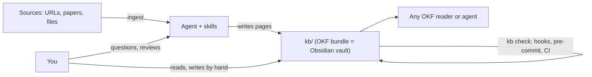

# Design overview

## Three ideas combined

The template combines three existing ideas and adds the tooling that keeps
them consistent.

**The LLM wiki.** In Andrej Karpathy's
[LLM wiki](https://gist.github.com/karpathy/442a6bf555914893e9891c11519de94f)
pattern, an agent does not answer from raw documents each time, as
retrieval-augmented generation does. It *compiles* each source once into a
set of interlinked markdown pages, updating the pages the source touches.
Knowledge accumulates: later questions are answered from pages that already
integrate earlier sources, and good answers are filed back as new pages.
The human chooses sources, reads, asks and curates; the agent does the
writing and the bookkeeping.

**The Open Knowledge Format.** [OKF v0.2](https://github.com/GoogleCloudPlatform/open-knowledge-format/blob/main/SPEC.md)
specifies a *bundle*: a folder of markdown files, each with YAML
frontmatter and a `type`, plus reserved `index.md` and `log.md` files. It
also defines provenance fields (`generated`, `verified`, `sources`). A
bundle is readable by any OKF consumer, by any agent, and by people, with no
database and no application. Choosing OKF means the knowledge base
outlives any tool used to write it.

**Obsidian.** A wiki that only agents can comfortably read is not a
personal knowledge base. [Obsidian](https://obsidian.md) gives the human a
reader and editor over the same files: backlinks, a graph, templates,
dashboards.

The template's job is to make these three agree, and to keep them agreeing
after every edit, whoever makes it.

## The vault is the bundle

`kb/` is at the same time the OKF bundle root and the Obsidian vault root.
Everything else stays outside it: agent instructions, skills, schema,
tooling.

The reason is links. OKF recommends bundle-root links such as
`/sources/brewer-2012.md`. Obsidian resolves a link that starts with `/`
against the vault root. The two meanings coincide only when the two roots
are the same folder.

The second reason is conformance. OKF requires frontmatter with a `type` on
every `.md` file in the bundle, other than the reserved ones. `AGENTS.md`,
`CLAUDE.md` and skill files have no such frontmatter; inside the bundle they
would make it invalid, and some validators stop on them.

Two alternatives were rejected:

- **Author in Obsidian's native style and compile to OKF in CI**, with
  `[[wikilinks]]` and a plugin for typed links. The repository itself would
  not be a bundle, and the compiler would be one more program to maintain.
- **Make the repository root the vault, with `kb/` as a sub-folder.**
  Bundle-root links would then not resolve in Obsidian.

Consequences:

- every `.md` file under `kb/` needs frontmatter, including Obsidian
  templates, which have `type: Template`;
- Obsidian must delete to the system trash, because a `.trash/` folder
  would put non-conforming files into the bundle;
- Obsidian plugins that only understand wikilinks cannot be used.

## Generated indexes

Every folder of the bundle has an `index.md`, and none of them is written by
hand. `kb index` generates them from each page's `title` and `description`
and from the folder titles and descriptions in `schema/taxonomy.yaml`.

Indexes are the agents' first navigation layer: reading `kb/index.md` and
then one folder's index costs a few hundred tokens and shows every page
with a one-sentence summary. That only works if the indexes are complete
and current, which is why they are generated, and why `kb check` fails
when one is out of date (H040). It is also why the `description` of every
page must be a sentence that stands alone.

Indexes use relative `./` links, unlike pages, so any subtree of the bundle
can be copied out and still have working indexes.

## The log

`kb/log.md` is OKF's update log: `## YYYY-MM-DD` sections, newest first,
one line per operation. The agent adds an entry after each ingest, filed
query or lint pass, with links to the pages concerned, through
`kb log`, which keeps the format valid. The log is the human-readable
history of the knowledge; git holds the line-level history.

## Tiered retrieval

Agents find pages in three tiers, and a heavier tier is enabled only when
the lighter ones fail:

1. navigate `index.md` files, then `rg` over `kb/`;
2. filter by frontmatter with `kb find` (type, tags, status, folder, trust);
3. hybrid search with qmd (keywords, local embeddings, reranking), with its
   index outside git.

The markdown files are always the source of truth; search indexes are
rebuildable caches. A vector database from the start was rejected as
premature: it would duplicate state the markdown already holds. Search
plugins that live only inside Obsidian were rejected because command-line
agents cannot use them.

## A house profile on top of OKF

OKF is deliberately permissive: `type` is the only required key, broken
links and unknown keys are tolerated. The template adds a stricter *house
profile*: required `title`, `description`, `tags`, `status` and
`generated`; a controlled vocabulary of types, each allowed in certain
folders; kebab-case names; footnote citations that must match `sources`.
These rules are what keep a wiki written by many agent sessions coherent.

The profile is split so that each knowledge base can adapt it without
forking: the core shapes are in the template-managed
`frontmatter.schema.json`, while types, relations and extra fields are in
the knowledge base's own `vocabulary.yaml`, which extends the schema.

`kb check` reports OKF violations (`O` codes) separately from house-rule
errors (`H`) and warnings (`W`), and CI also runs an independent OKF
validator, so the claim "this is an OKF bundle" does not rest on the
template's own reading of the spec.

## Why a Copier template

The machinery (the `kb` tool, the skills, the hooks, the conventions, the
Obsidian setup) does not depend on what a knowledge base is about. A
template separates it from the content:

- each knowledge base is a self-contained repository, with its tooling
  vendored in and its own tool version;
- `copier update` merges tooling improvements into existing knowledge bases,
  and never touches the files each knowledge base owns.

Publishing the tooling as a separate package was considered. It would force
each knowledge base to depend on a published package just to run CI, and
would not cover the agent layer, the justfile or the CI workflow. With
Copier, a knowledge base is complete in its repository.

Updates need release tags in the template repository, so that Copier has a
base version to compare against.
